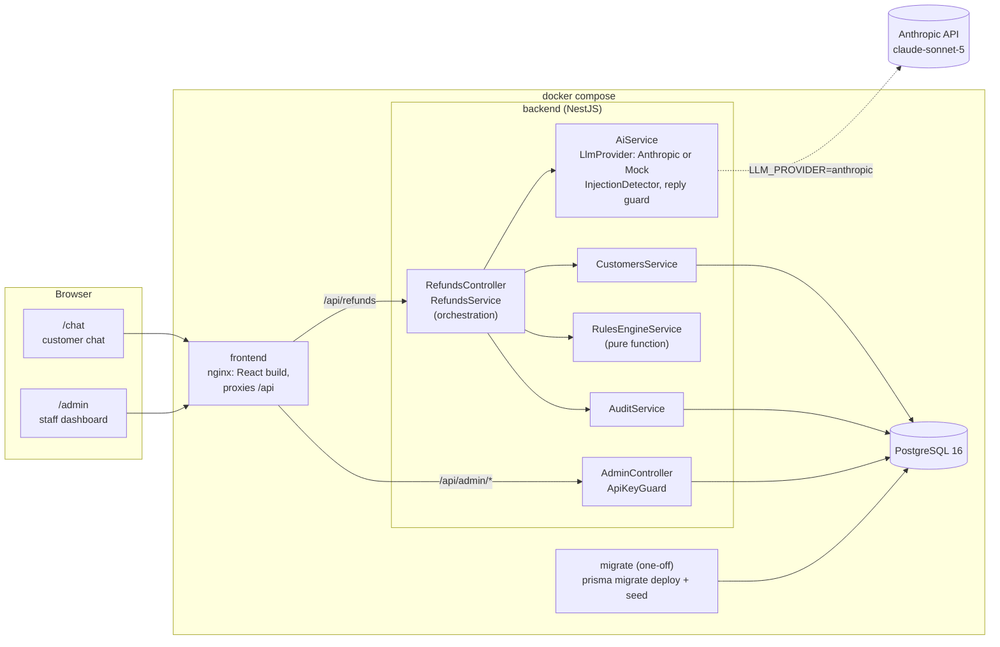
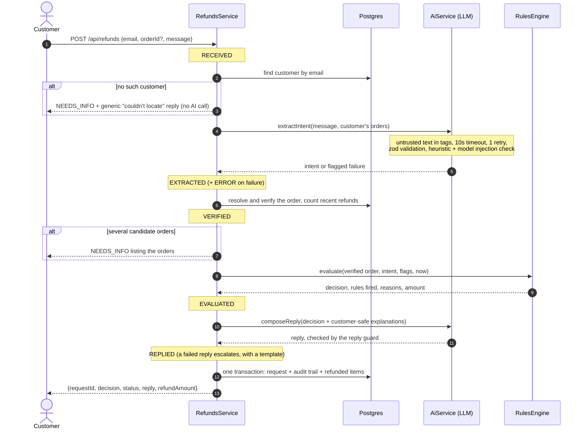
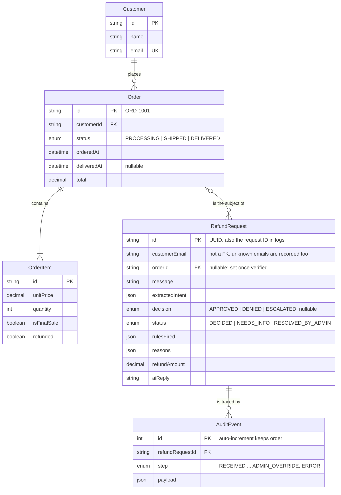

# Architecture

## The one rule

**The AI extracts and communicates. It never decides.** A language model turns the
customer's free text into structured data and writes the reply. The decision is made by a
deterministic rules engine, working only on data read from the database. Any AI failure
ends in escalation to a person, never in an approval.

## System overview

- **frontend**: nginx serves the Vite build and proxies `/api` to the backend, so the browser
  only ever talks to one origin. It also sets the security headers.
- **backend**: a stateless NestJS app. It is not published on the host; all traffic
  comes through nginx.
- **migrate**: the release step. It applies migrations and seeds the demo data, then exits;
  the backend only starts once it has succeeded.
- **postgres**: all state lives here: customers, orders, refund requests and the audit log.

## A refund request, step by step

Each step is recorded in the audit trail and logged to stdout with the request ID. The
request, its audit events and any items marked refunded are written in **one transaction**,
and items are only marked refunded if they still aren't, so two concurrent requests can
never refund the same item.

## Backend modules

| Module | Responsibility |
|--------|----------------|
| `config/` | Joi validation of every environment variable at startup; the policy constants |
| `prisma/` | `PrismaService`: connects on startup, disconnects on shutdown |
| `customers/` | Customer and order lookups (orders are found by ID whoever owns them, so P7 can check ownership) |
| `ai/` | `LlmProvider` interface, `AnthropicProvider`, `MockProvider`, prompts, the zod schema, `InjectionDetector`, the reply guard and templates, and `AiService` (timeout, retry, validation) |
| `policy/` | `RulesEngineService`: P1-P9 in a fixed order, as a pure function with integer-cent money |
| `refunds/` | The public endpoint, the DTO and the orchestration pipeline |
| `audit/` | The per-request audit trail |
| `admin/` | `ApiKeyGuard`, request list and detail, stats, and admin overrides |
| `demo/` | Seed fixtures, the 15 scenarios, `GET /api/demo/scenarios` |
| `health/` | `GET /api/health` with a database check (used by the Docker healthcheck) |
| `common/` | The global exception filter (one JSON error shape) and JSON helpers |

## Data model

Money is `Decimal(10,2)` in the database and integer cents inside the rules engine, so no
decision depends on floating-point arithmetic.

## Why it is shaped this way

- **The rules engine is a pure function.** Its input is stored with every decision in the
  `EVALUATED` audit event, so any decision can be replayed exactly. The e2e tests do this.
- **`AiService` wraps every provider.** Timeout, retry, output validation and the
  injection check apply the same way to the real model and the mock, and are tested once with
  a stubbed provider.
- **The mock provider returns raw JSON** like a real model, so its output goes through the
  same parsing and validation. The whole system runs without an API key.
- **Stateless backend.** No sessions or in-process business state, so it can run as
  several instances. The one exception is the rate limiter's in-memory counter (see the
  README's trade-offs).
